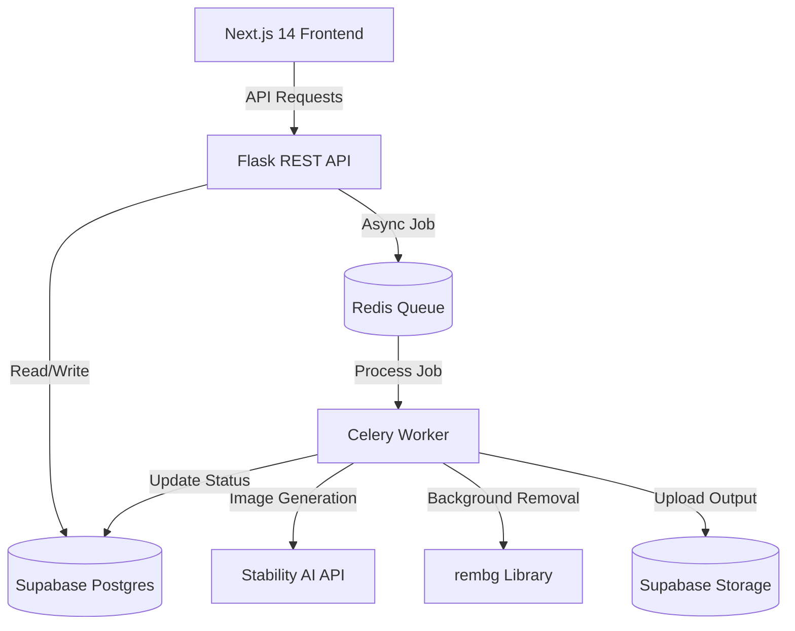

# TaskHub — AI Product Photography Platform

TaskHub is a production-grade SaaS platform combining **Task Management** with an **AI-Powered Product Photography Studio**. It allows admins to manage product tasks and designers to generate studio-quality product photos using Stability AI.

### 🌐 Live Deployments
* **Frontend:** [https://task-hub-omega-seven.vercel.app](https://task-hub-omega-seven.vercel.app)
* **Backend API:** [https://taskhub-production-94ae.up.railway.app](https://taskhub-production-94ae.up.railway.app)

---

## 🏗️ Architecture



---

## 🛠️ Tech Stack

* **Frontend:** Next.js 14 (App Router), TypeScript, Tailwind CSS, Zustand, React Query, Framer Motion
* **Backend:** Python, Flask, Celery, Redis
* **Database & Auth:** Supabase (PostgreSQL, Storage Buckets, Row Level Security)
* **AI Engine:** Stability AI (SDXL img2img) & `rembg` for background removal
* **Notifications:** Resend API for transactional emails

---

## 🚀 Setup & Local Development

### 1. Database Setup (Supabase)
1. Create a project at [supabase.com](https://supabase.com).
2. Open the **SQL Editor** in Supabase and run:
   * [database/migrations/001_initial_schema.sql](file:///c:/Users/sandeep%20kumar/Downloads/taskhub-ai-product-photography-platform-main%281%29/taskhub-ai-product-photography-platform-main/database/migrations/001_initial_schema.sql)
   * [database/policies/rls_policies.sql](file:///c:/Users/sandeep%20kumar/Downloads/taskhub-ai-product-photography-platform-main%281%29/taskhub-ai-product-photography-platform-main/database/policies/rls_policies.sql)
   * [database/seeds/seed_data.sql](file:///c:/Users/sandeep%20kumar/Downloads/taskhub-ai-product-photography-platform-main%281%29/taskhub-ai-product-photography-platform-main/database/seeds/seed_data.sql) *(Optional, for dev seeding)*
3. Create a public storage bucket named `task-images`.

### 2. Backend Setup
1. Navigate to the backend directory:
   ```bash
   cd backend
   ```
2. Create and activate a virtual environment:
   ```bash
   python -m venv venv
   # On Windows:
   venv\Scripts\activate
   # On macOS/Linux:
   source venv/bin/activate
   ```
3. Install dependencies:
   ```bash
   pip install -r requirements.txt
   ```
4. Copy the environment template and fill in variables:
   ```bash
   cp .env.example .env
   ```
5. Run the server:
   ```bash
   flask run --port 5000
   ```

### 3. Celery Worker Setup
Ensure you have a local Redis server running, then start the Celery worker:
```bash
cd backend
celery -A workers.celery_app worker --loglevel=info
```

### 4. Frontend Setup
1. Navigate to the frontend directory:
   ```bash
   cd frontend
   ```
2. Install dependencies:
   ```bash
   npm install
   ```
3. Copy the environment template and fill in variables:
   ```bash
   cp .env.local.example .env.local
   ```
4. Run the development server:
   ```bash
   npm run dev
   ```
   Open [http://localhost:3000](http://localhost:3000) to view the application.

---

## 🔒 Environment Variables Reference

### Backend variables (`backend/.env`):
* `SUPABASE_URL` - Supabase Project URL
* `SUPABASE_SERVICE_KEY` - Supabase Service Role Secret key
* `SUPABASE_ANON_KEY` - Supabase Anon Public key
* `JWT_SECRET` - Secret key used to sign JWT auth cookies
* `FRONTEND_URL` - Origin of the frontend application (for CORS)
* `REDIS_URL` - Connection string for Celery queue (Redis)
* `RESEND_API_KEY` - Transactional email token from Resend
* `FROM_EMAIL` - Sender email address
* `STABILITY_API_KEY` - API key for Stability AI

### Frontend variables (`frontend/.env.local`):
* `NEXT_PUBLIC_API_URL` - URL of the running backend API
* `NEXT_PUBLIC_SUPABASE_URL` - Supabase Project URL
* `NEXT_PUBLIC_SUPABASE_ANON_KEY` - Supabase Anon Public key
