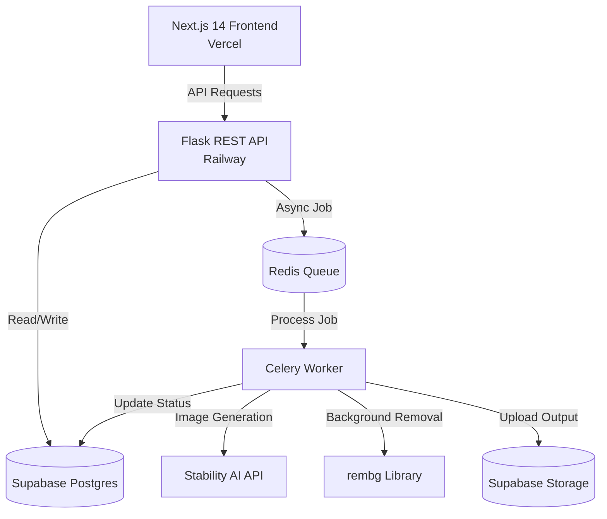

# TaskHub — AI Product Photography Platform

TaskHub is a production-grade SaaS platform combining **Task Management** with an **AI-Powered Product Photography Studio**. It allows administrators to assign tasks and designers to generate studio-quality product photos using Stability AI (SDXL image-to-image) while preserving product consistency.

### 🔗 Live Project Links
* **Live Web Application:** [https://task-hub-omega-seven.vercel.app](https://task-hub-omega-seven.vercel.app)
* **Live API Backend:** [https://taskhub-production-94ae.up.railway.app](https://taskhub-production-94ae.up.railway.app)
* **Backend Health Status:** [https://taskhub-production-94ae.up.railway.app/health](https://taskhub-production-94ae.up.railway.app/health)

---

## 🏗️ System Architecture

---

## 🌟 Key Features

* **Task Management & Workflow:** Clear status transitions (`pending` ➔ `assigned` ➔ `in_progress` ➔ `submitted` ➔ `accepted`/`revision_requested`).
* **AI Photography Studio:** Automatically generates 8 distinct product photography variations (white background, themed scenes, creative angles, and model wear).
* **Product Consistency Pipeline:** Implements image-to-image (img2img) at low strength and background removal (`rembg`) to preserve exact product outlines.
* **Admin Review System:** Interactive dashboard to compare original vs. generated photos and accept or request revisions.
* **Secure Auth Integration:** Implements Google and GitHub OAuth 2.0 via Supabase with custom JWT validation.
* **Email Notifications:** Transactional emails for task assignment and submission status using the Resend SDK.

---

## 🛠️ Technology Stack

* **Frontend:** Next.js 14 (App Router), TypeScript, Tailwind CSS, Zustand, React Query, Framer Motion
* **Backend API:** Python, Flask, Celery, Redis
* **Database & Auth:** Supabase (PostgreSQL, Storage, Row Level Security)
* **AI Integration:** Stability AI & `rembg` (background removal)
* **Mailing Service:** Resend API
